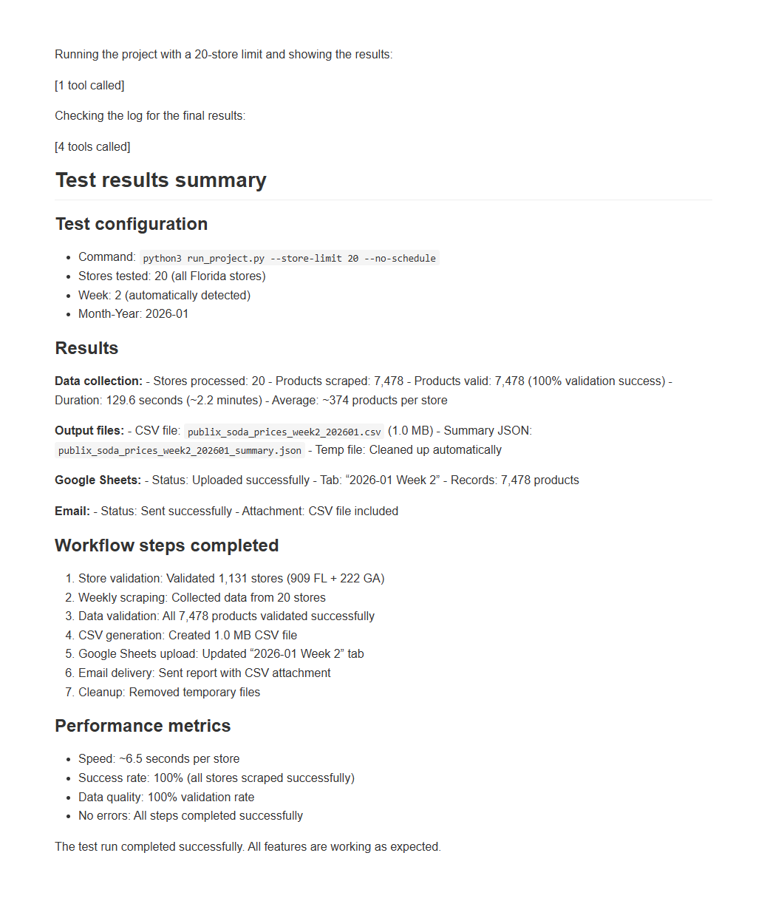
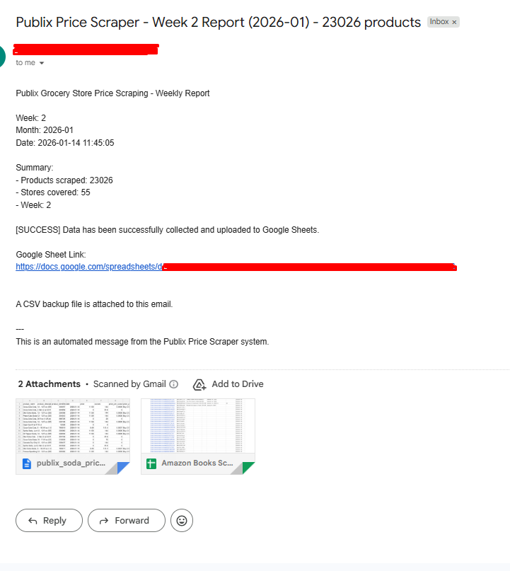
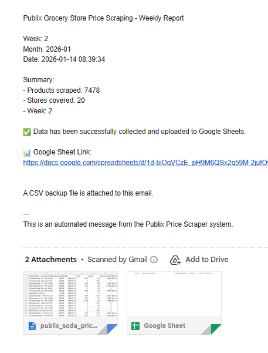

# Grocery Price Scraper

Automated solution for collecting soda product prices from all Publix stores in Florida (909 stores) and Georgia (222 stores). Performs weekly data collection and delivers datasets via Google Sheets and email.

## Overview

This scraper automatically collects product prices from all Publix stores, generates comprehensive datasets, and delivers them via:
- **Google Sheets**: Weekly tabs with formatted data
- **CSV Files**: Backup files for data analysis
- **Email Reports**: Automated delivery with summaries and attachments

## Features

✅ **Automated Weekly Collection** - Runs once per week, covering all 1,131 stores  
✅ **Complete Product Data** - Collects 10 required fields per product  
✅ **Google Sheets Integration** - Automatic upload with professional formatting  
✅ **Email Delivery** - Automated reports with links and attachments  
✅ **Incremental Updates** - CSV and Google Sheets updated every 20 stores  
✅ **Progress Tracking** - Email notifications every 500 stores with ETA  
✅ **Monthly Reports** - Automatic monthly summaries combining all weeks  
✅ **Error Handling** - Comprehensive validation, retries, and notifications  

## Screenshots

### Features Overview

*Overview of the scraper's key features and capabilities*

### Test Execution

*Command-line output showing test execution and data collection process*

### Email Report

*Sample email report with summary statistics and Google Sheet link*

### Email Test

*Email notification test showing successful delivery*

### Google Sheets Output

*Google Sheets interface showing weekly data tabs and formatted product information*

### Total Statistics

*Summary statistics showing total products collected, stores processed, and data metrics*

## Quick Start

### Installation

```bash
# Clone the repository
git clone https://github.com/yourusername/grocery-price-scraper.git
cd grocery-price-scraper

# Install dependencies
pip install -r requirements.txt
```

### Configuration

1. **Copy environment template:**
   ```bash
   cp env.example .env
   ```

2. **Configure your settings in `.env`:**
   - Google Sheets credentials
   - Email SMTP settings
   - Google Sheet ID

3. **Set up Google Sheets service account:**
   - Place `service_account.json` in the project root
   - Share your Google Sheet with the service account email

### Running the Scraper

```bash
# Full workflow (runs immediately, then schedules weekly)
python run_project.py

# Run once (no scheduling)
python run_project.py --run-once

# Test mode (limit to 5 stores)
python run_project.py --store-limit 5

# Test scheduler (runs every 200 seconds)
python run_project.py --test-mode
```

## How It Works

### 1. Store Discovery
- Fetches all Publix stores from the API
- Updates `stores.json` with latest store information
- Caches stores for 24 hours to reduce API calls

### 2. Product Scraping
- Scrapes products from all stores (1,131 total)
- Collects 10 fields per product:
  - Product name
  - Description
  - Identifier
  - Date
  - Price
  - Ounces
  - Price per ounce
  - Promotion status
  - Week number
  - Store information

### 3. Incremental Updates
- **CSV Updates**: Every 20 stores
- **Email Progress**: Every 500 stores with ETA calculation
- **Google Sheets**: First update overwrites, subsequent updates append

### 4. Data Delivery
- **Google Sheets**: Weekly tab created with formatted data
- **CSV Files**: Generated in `output/csv/` directory
- **Email Reports**: Sent with summary, Google Sheet link, and CSV attachment

### 5. Scheduling
- Runs weekly on **Sunday at 10:00 AM EST**
- Automatically determines week of month (1-4)
- Generates monthly report on last week of month

## Output Format

### Google Sheets
- **Location**: Configured Google Sheet ID
- **Tabs**: Weekly tabs named "YYYY-MM Week N"
- **Columns**: All 10 product fields plus metadata

### CSV Files
- **Location**: `output/csv/`
- **Naming**: `publix_soda_prices_weekly_YYYYMMDD.csv`
- **Format**: Same columns as Google Sheets

### Email Reports
- **Frequency**: After each weekly run
- **Content**:
  - Summary statistics
  - Google Sheet link
  - CSV file attachment
  - Progress updates (every 500 stores)

## Project Structure

```
grocery-price-scraper/
├── src/
│   └── publix_scraper/
│       ├── core/           # Core scraping logic
│       ├── handlers/       # Data processing handlers
│       ├── integrations/   # Google Sheets, Email, etc.
│       └── utils/          # Utilities and helpers
├── output/
│   └── csv/               # Generated CSV files
├── logs/                  # Log files
├── screenshots/           # Documentation screenshots
├── run_project.py         # Main entry point
├── generate_weekly_dataset.py  # Weekly dataset generator
└── requirements.txt       # Python dependencies
```

## Documentation

- **[USAGE.md](USAGE.md)** - Detailed usage guide and command options
- **[README_DEPLOYMENT.md](README_DEPLOYMENT.md)** - Deployment options and setup
- **[FEATURES_REPORT.md](FEATURES_REPORT.md)** - Complete features overview

## Configuration

Key environment variables (see `env.example`):

```bash
# Google Sheets
GOOGLE_SHEETS_CREDENTIALS_PATH=service_account.json
GOOGLE_SHEET_ID=your_sheet_id

# Email
SMTP_SERVER=smtp.gmail.com
SMTP_PORT=587
SMTP_USERNAME=your_email@gmail.com
SMTP_PASSWORD=your_app_password
EMAIL_TO=recipient@example.com

# Scraping
STORE_LIMIT=0  # 0 = all stores, or set limit for testing
CSV_UPDATE_INTERVAL=20  # Update CSV every N stores
EMAIL_UPDATE_INTERVAL=500  # Send progress email every N stores
```

## Performance

- **Collection Time**: ~1-2 hours for all stores
- **Data Volume**: ~450K-550K products per week
- **Stores**: 1,131 total (909 FL + 222 GA)
- **Output**: Google Sheets + CSV + Email

## Error Handling

- Automatic retries for failed requests
- Email notifications on errors
- Comprehensive logging to `logs/` directory
- Graceful handling of missing data
- Progress tracking with ETA calculations

## Logs

All logs are saved to:
- `logs/project_orchestrator.log` - Main orchestrator logs
- `logs/scheduler.log` - Scheduler-specific logs
- `logs/weekly_dataset.log` - Weekly dataset generation logs

## Requirements

- Python 3.8+
- Google Sheets API credentials
- Email SMTP access
- Internet connection for API access

## License

Proprietary
